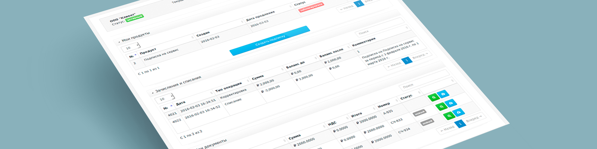
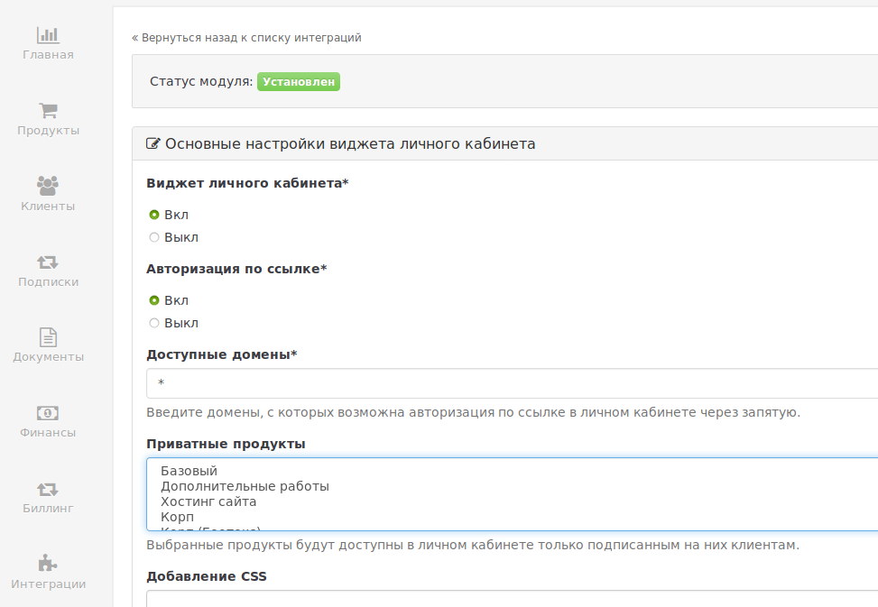

# Интеграция интерфейса личного кабинета PricePlan с личным кабинетом стороннего веб сервиса

Личный кабинет (ЛК) PricePlan может быть встроен в ваш сервис. 
После интеграции пользователи сервиса смогут пополнять баланс для 
физических и юридических лиц, управлять своими подписками 
(создавать новые, изменять существующие), работать с документами, 
следить за зачислениями и списаниями.


**Обратите внимание:** функция по умолчанию отключена, 
её нужно дополнительно включить в настройках биллинга 
(Интеграции -> Кабинет клиента).



## Простейший сценарий
Для реализации простейшего сценария вам понадобиться хранить на своей стороне ID клиентов в системе Priceplan
полученных при [создании клиента](https://docs.priceplan.ru/#api-Client-CreateClient "создание клиента").

Простейший вариант реализации выглядит следующим образом:

1. Ваш клиент входит в "ЛК" на вашем сайте (например, посредством логина и пароля, которые хранятся в вашей базе данных)
2. При успешном входе на стороне вашего сервера создается прямая ссылка на вход в ЛК priceplan
3. Клиент перенаправляется на эту ссылку (По ней открывается Личный кабинет нужного пользователя)

### Как создать прямую ссылку на вход?

Процесс создания прямой ссылки на вход клиента достаточно прост:

1. Вам нужно войти в аккаунт менеджера
2. Сделать **POST** запрос на `https://{subdomain}-lk.priceplan.pro/api/clients/<id_клиента_в_системе_priceplan>/auth-key/`
3. Результатом данного запроса будет JSON следующего вида:
```json
{
    "data": {
        "key": "kwFkMcnsyiyqqRKlKMErbJIID3tYNfq9Pqxw82AoL1CzCQfUab",
        "expire_date": "2021-06-04 05:17:50.606808+03:00",
        "link": "/auth-key/kwFkMcnsyiyqqRKlKMErbJIID3tYNfq9Pqxw82AoL1CzCQfUab/"
    },
    "success": true
}
```
4. Ссылка на вход, на которую вам нужно перенаправить клиента выглядит как `https://{subdomain}-lk.priceplan.pro/auth-key/<текст из поля "key" из JSON'a выше>/`

### Пример кода на python и django:
```python
import requests
import json
from django.shortcuts import redirect

SUBDOMAIN = "test"
LOGIN_TPL = f'https://{SUBDOMAIN}-lk.priceplan.pro/api/login'
AUTH_KEY_GEN = \
    f'https://{SUBDOMAIN}-lk.priceplan.pro/api/clients/%s/auth-key/'

REDIRECT_LINK = f'https://{SUBDOMAIN}-lk.priceplan.pro/auth-key/%s/'

# Авторизация в качестве менеджера
def index(request):
    """Простой view с redirect'ом"""
    session = requests.session()
    payload_manager = {
        'user': 'Логин менеджера',
        'password': 'пароль менеджера'
    }
    
    rsp_login = session.post(LOGIN_TPL, data=json.dumps(payload_manager))
    user_id = 1 # id Клиента в системе priceplan, полученный где-то выше
    rsp_auth_key = session.post(AUTH_KEY_GEN % user_id) # создание ссылки
    auth_data = json.loads(rsp_auth_key.content) 
    priceplan_auth_key = auth_data['data']['key'] # получение auth_key
    return redirect(REDIRECT_LINK % priceplan_auth_key)

```
### Пример кода на PHP (curl):
```php
<?php

$USER_ID = 40; // ID клиента в системе priceplan полученное где-то выше


$MANAGER_LOGIN = "priceplan";
$MANAGER_PASSWORD = "priceplan";

$SUBDOMAIN = "test";

$LOGIN_TPL = "http://$SUBDOMAIN-lk.pp.ru:8000/api/login";
$AUTH_KEY_GEN = "http://$SUBDOMAIN-lk.pp.ru:8000/api/clients/%d/auth-key/";
$REDIRECT_LINK = "http://$SUBDOMAIN-lk.pp.ru:8000/auth-key/%s/";


$LOGIN_DATA = json_encode(array(
    'user' => $MANAGER_LOGIN,
    'password' => $MANAGER_PASSWORD
), JSON_UNESCAPED_UNICODE);

$ch = curl_init();
curl_setopt($ch, CURLOPT_RETURNTRANSFER, true);
curl_setopt($ch, CURLOPT_URL, $LOGIN_TPL);
curl_setopt($ch, CURLOPT_POST, true);
curl_setopt($ch, CURLOPT_POSTFIELDS,     $LOGIN_DATA );
curl_setopt($ch, CURLOPT_HTTPHEADER,     array('Content-Type: application/json'));
curl_setopt($ch, CURLOPT_COOKIEJAR, '/tmp/cookies.txt');
curl_setopt($ch, CURLOPT_COOKIEFILE, '/tmp/cookies.txt');
$res = curl_exec($ch);
if (curl_error($ch)) {
    echo curl_error($ch);
}
else{
    curl_setopt($ch,CURLOPT_URL, sprintf($AUTH_KEY_GEN, $USER_ID));

    $res = curl_exec($ch);
    $auth_key = json_decode($res, true)['data']['key'];

    header ("Location: " . sprintf($REDIRECT_LINK, $auth_key));
}

?>

```

